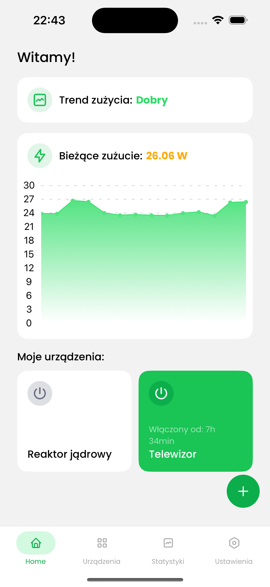
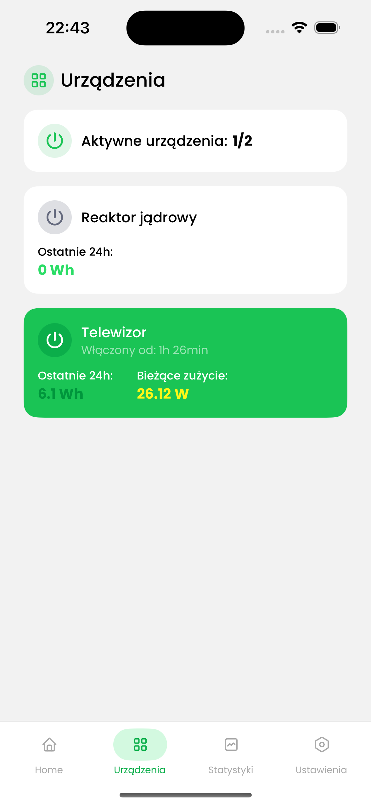
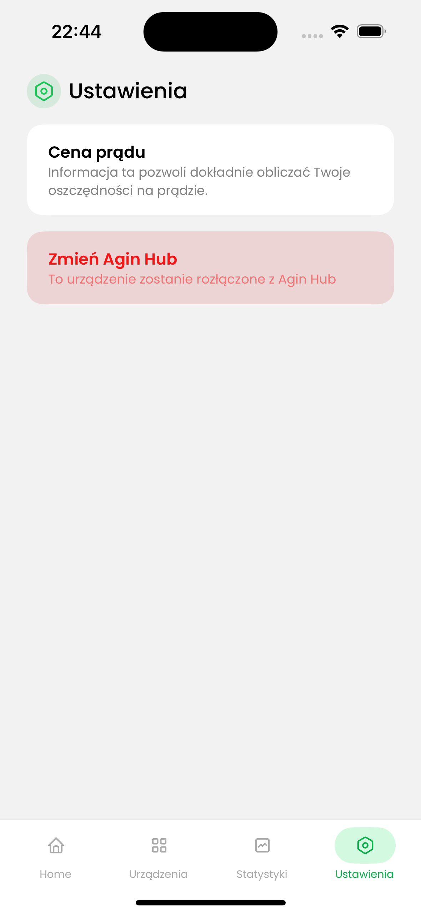
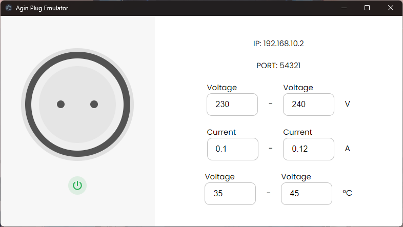

# Agin Energy


## Struktura repozytorium

- `AginEnergyHub` - Oprogramowanie Agin Hub, który steruje gniazdkami oraz pobiera z nich dane
- `AginEnergyMobile` - Aplikacja mobilna do przeglądania danych oraz zarządzania wtyczkami
- `AginEnergyRelay` - Serwer przekaźnikowy odpowiadający za powiadomienia push
- `AginEnergyWebsite` - Strona projektu ([energy.agin.rocks](https://energy.agin.rocks))
- `AginPlug` - Oprogramowanie wtyczki Agin Plug, napisane w C++ z pomocą ESPHome
- `AginPlugEmulator` - Emulator wtyczki napisany w Electron.js, który pozwala na przetestowanie aplikacji bez potrzeby posiadania fizycznego gniazdka

## Aplikacja Agin Energy

[Spot filmowy Agin Energy](https://youtu.be/1xTRd-yT9cw)

[Strona internetowa projektu](https://energy.agin.rocks/)

### Opis

**Agin Energy** to aplikacja na telefony z systemem Android i iOS, która z pomocą inteligentnego huba i gniazdek mierzy zużycie energii i wyświetla statystyki, pomagając użytkownikom oszczędzać prąd i pieniądze. Dzięki analizie danych aplikacja sugeruje, jak zmniejszyć zużycie energii, wspierając ekologiczne i ekonomiczne decyzje.

### Działanie

**Agin Energy** jest clientem pozwalającym zarządzać systemem huba z gniazdkami, jednak w przeciwieństwie do większości aplikacji typu smart home zwraca ona uwagę na aspekt oszczędności energii. Jej zadaniem jest pomóc zobrazować wykorzystanie energii w domu i zmotywować do podjęcia działań na rzecz środowiska. Aplikacja została zbudowana w środowisku React Native przez co może być dostępna zarówno na Androidzie jak i na iOS. Posiada ona takie funkcje jak:

- Pokazywanie ile prądu zużywają wszystkie gniazdka połączone z aplikacją
- Pokazywanie wszystkich wartości jakie rejestruje gniazdko (napięcie, natężenie, moc, temperatura urządzenia)
- Dzięki wykorzystaniu huba, który zapisuje wartości gniazdek do bazy, możliwe jest odczytanie i analiza zużycia w czasie i porównania trendów zużycia prądu
- Powiadomienia push, które w przypadku nadmiernego zużycia prądu poinformują użytkownika i zachęcą go do wyłączenia urządzenia

### Navigowanie po aplikacji

Aplikacja Agin Energy posiada następujące ekrany:

- Ekran powitalny pokazujący opisy urządzeń oraz pozwalający na sparowanie Agin Huba z aplikacją oraz ustawienie ceny prądu.

- Ekran główny, w którym znajdują się informacje na temat włączonych urządzeń, obecnego całkowitego poboru prądu i trend jego zużycia. W prawym dolnym rogu znajduje się również przycisk do dodawania nowej wtyczki Agin Plug.



- Ekran urządzeń, w którym znajdują się wszystkie połączone z aplikacją urządzenia, a także krótkie informacje o nich stanie i poborze.



- Ekran ustawień, w którym można zmienić cenę prądu lub hub, do którego aplikacja jest połączona



- Ekran statystyk, w którym są wykresy porównujące zużycie z ostatniej godziny i dnia, ranking urządzen zużywających najwięcej prądu oraz obecne łączne zużycie
- Ekran dodawania urządzenia, który można wywołać z poziomu guzika z plusem na ekranie głównym, pozwalający na sparowanie Agin Pluga lub jego emulatora
- Ekran szczegółów urządzenia, w którym znajdują się szczegółowe statystyki, dotyczące zużycia prądu, napięcia, natężenia, a także temperatury, zarówno w czasie rzeczywistym, jak i na przestrzeni ostatnich 24 godzin. Dodatkowo w prawym górnym rogu jest przycisk otwierający menu z możliwościami ustawienia koloru diody urządzenia lub usunięcia urządza z listy sparowanych.

## Agin Plug

### Opis

**Agin Plug** to inteligentna wtyczka oparta na mikrokontrolerze ESP8266 i ESPHome, jest to zmodyfikowane gniazdko firmy Tauron. Wtyczka jest wyposażona w układ pomiarowy ADE7763, który precyzyjnie mierzy napięcie i zużycie energii. Agin Plug łączy się z Agin Hub, umożliwiając użytkownikom monitorowanie i kontrolowanie poboru prądu oraz optymalizację zużycia energii.

### Działanie

**Agin Plug** to inteligentne gniazdko, które mierzy dane i przekazuje je hubowi za pomocą SSE. Jest one zmodyfikowaną wersją gniazdka firmy Tauron poprzez dodanie do niego ESP8266 z wgranym oprogramowaniem ESPHome. Rozwiązanie takie jest wygodne, ponieważ nie wymaga zakupienia konkretnego sprzętu i daje możliwość użycia jakiegokolwiek inteligentnego gniazdka z odpowiednim układem pomiarowym.

### Emulator

Na potrzeby prezentacji aplikacji przygotowaliśmy aplikację w środowisku Electron.js, która wiernie oddaje działanie prawdziwego urządzenie, z tą różnicą, że zamiast mierzyć wartości, są one generowanie losowo z zakresu podanego przez użytkownika.

### Omówienie emulatora

Po włączeniu emulatora ukaże się ekran, w którym można zaprezentowac wszystkie funkcje jakie posiada Agin Plug. Po lewej stronie znajduje się widok samego Pluga, z przyciskiem do jego włączania (na prawdziwym urządzeniu przycisk znajduję po zewnętrznej stronie obręczy gniazdka). Po prawej znajdują się informacje o IP i porcie na jakim chodzi SSE emulatora, a pod nimi pola do wprowadzenia widełek wartości jakie aplikacja ma losować i wysyłać do aplikacji (ma to zobrazować mniej więcej jak wyświetlają się w aplikacji dane z prawdziego gniazdka)



## Agin Hub

### Opis

**Agin Hub** to inteligentny hub oparty na Raspberry Pi 3, który zarządza systemem Agin Energy. Łączy się z gniazdkami Agin Plug, zbiera dane o zużyciu energii i udstępnia je do aplikacji mobilnej. Agin Hub umożliwia zdalne monitorowanie i sterowanie urządzeniami, dzięki czemu użytkownicy mogą optymalizować zużycie prądu w domu, wspierając efektywne i ekologiczne zarządzanie energią. Wysyła on powiadomienia push poprzez serwer przekaźnikowy pod adresem `energyapi.agin.rocks` (folder `AginEnergyRelay`)

### Działanie

Software Huba działa w środowisku Node.js, przez co za hub może posłużyć tak naprawdę każdy komputer. Zastosowanie huba było potrzebne, aby zbierać dane ze wszystkich gniazdek, analizować je i w razie potrzeby wysyłać powiadomienia push na telefon. Hub pozwala też na podgląd zużycia na wielu instancjach aplikacji w czasie rzeczywistym. Komunikuje on się z telefonem za pomocą Socket.IO, zbiera informacje z gniazdek przez SSE i zapisuje je w bazie InfluxDB, co pozwala na ich późniejszy przegląd w aplikacji. Program Huba pamięta przypisane mu gniazdka, wraz z ustawionymi im przez użytkownika nazwami, zapisując je w MongoDB. Użycie jako urządzenia Raspberry Pi, pozwala na dużą energooszczędność ze względu na taką specyfikę urządzenia, jednak nic nie stoi na przeszkodzie, aby w roli huba użyć np. domowy server.

## Na jakie potrzeby odpowiada najsze rozwiązanie?

W Polsce na obecny moment ponad 80% źródeł energii to paliwa kopalne, które powodują znaczną produkcje dwutlenku węgla, dlatego tak ważne jest teraz, aby zastanowić się czy chcemy dokładać się do dalszego zanieczyszczania środowiska, czy może możemy zrezygnować z niepotrzebnie palącego się światła lub nieustannie działającego telewizora. Większość ludzi nie jest w stanie wyobrazić sobie ile prądu potrafią zużyć pojedyńcze urządzenia, tym bardziej w skali czasu, w czym pomóc ma nasza aplikacja. Wierzymy, że jeżeli każdy zacznie od nawet niewielkiego zmniejszenia zużycia prądu, eliminując niepotrzebne działanie urządzeń, to w większej skali jest to w stanie zrobić realną różnicę na środowiku.

## Wszystkie technologie użyte w tym projekcie

### Środowiska:

- Node.js
- React
- React Native
- Electron.js
- PlatformIO
- Lekko zmodyfikowane ESPHome

### Języki programowania:

- TypeScript
- C++

## Dalszy rozwój projektu

Projekt ma dużo miejsca na rozwój i poprawki, bo niestety naszym największym wrogiem był czas. Jest dużo funkcji, które chcemy zaimplementować i wierzymy, że uda się to w przyszłości zrealizować. Projekt chcielibyśmy zachować w modelu open source, gdzie każdy mógłby nad nim pracować i przyczynić się do jego rozwoju. Nasze rozwiązanie na ten moment kierujemy głównie do pasjonatów robótek typu DIY, bo nie mamy możliwości produkcji gotowych produktów, co skutkuje potrzebą samodzielnego zmodyfikowania gniazdka i postawienia naszego oprogramowania na komputerze typu RaspberryPi. Chielibyśmy, aby projekt w przyszłości był bardziej "Plug and play".

## Ryzyka naszego rozwiązania

Głównym zagrożeniem dla naszego projektu jest pośpiech, który spowodował, że nie zdążyliśmy jeszcze wyeliminować wszystkich błędów występujących w aplikacji, przez co doświadczenie użytkowania systemu może nie być takie, jakiego byśmy sobie życzyli. Problemem jest również konieczność posiadania fizycznych urządzeń do działania aplikacji, przez co zniechęci to zapewne część osób przez korzystaniem z tego rozwiązania.

## Dlaczego powinniśmy wygrać?

Uważamy, że nasz projekt ma praktyczne zastosowanie i pomimo swoich niedoskonałości, jest w stanie pomóc w byciu bardziej ekologicznym. W projekt zainwestowaliśmy cały swój wolny czas, którego i tak nie posiadamy zbyt dużo ze względu na dużą ilość nauki w szkole. Pomimo, że w czasie pisania aplikacji wielokrotnie wyrywaliśmy sobie włosy na głowie, próbując rozwiązać czasami trywialne, a czasami nieoczywiste błędy, to przeprawa ta pozwoliła nam wyciągnąć dużo doświadczenia na przyszość. Wygrana pozwoliłaby nam na dalszy rozwój tego projektu, ulepszenie jego technologii (np. zaprojektowanie autoskich gniazdek), ale i rozpoczęcie nowych projektów, które miałyby na celu pomagać w życiu codziennym.

## Instrukcja uruchomienia

### Zależności

- Node.js w wersji 22 lub wyższej
- docker wraz z docker compose

### Instalacja oprogramowania Agin Huba

Po sklonowaniu [repozytorium](https://github.com/TymekV/AginEnergy) należy wykonać do konsoli komendę:

```
docker compose up -d
```

Do wykonania jej potrzebny będzie Docker, można go pobrać jako pakiet lub zainstalować program Docker Desktop. Więcej szczegółów tutaj [Oficjalna dokumentacja Dockera](https://docs.docker.com/compose/install/). Docker potrzebny jest do bezproblemowej instalacji baz, bez potrzeby ich konfigurowania.

Następnie należy przejść do folderu `AginEnergyHub` i z poziomu konsoli wspisać:

```
npm i
npm start
```

Do wykonania tej czynności potrzebny będzie [Node.js]() w wersji co najmniej 22.

### Instalacja emulatora Agin Pluga

Następnym krokiem będzie wejście na [stronę projektu](https://energy.agin.rocks) i z zakładki `Pliki` pobrać instalator emulatora pod Windowsa, Maca lub AppImage pod linuxa. Pod zainstalowaniu należy ją otworzyć.

### Instalacja Aplikacji Agin Energy

Do zainstalowania aplikacji Agin Energy na telefon z systemem Android, należy pobrać jej plik .apk ze [strony projektu](https://energy.agin.rocks), po czym otworzyć go na telefonie z poziomu ekploeratora plików (Powinien być w folderze `Downloads`). System zapyta się o pozwolenie na jej instalacje. Po zainstalowaniu aplikacji należy ją otworzyć i postępować zgodnie z instrukcjami w niej zawartymi. Należy pamiętać, że do poprawnego działania aplikacji należy podłączyć urządzenie z oprogramowaniem huba i telefon z aplikacją do tej samej sieci wifi.
